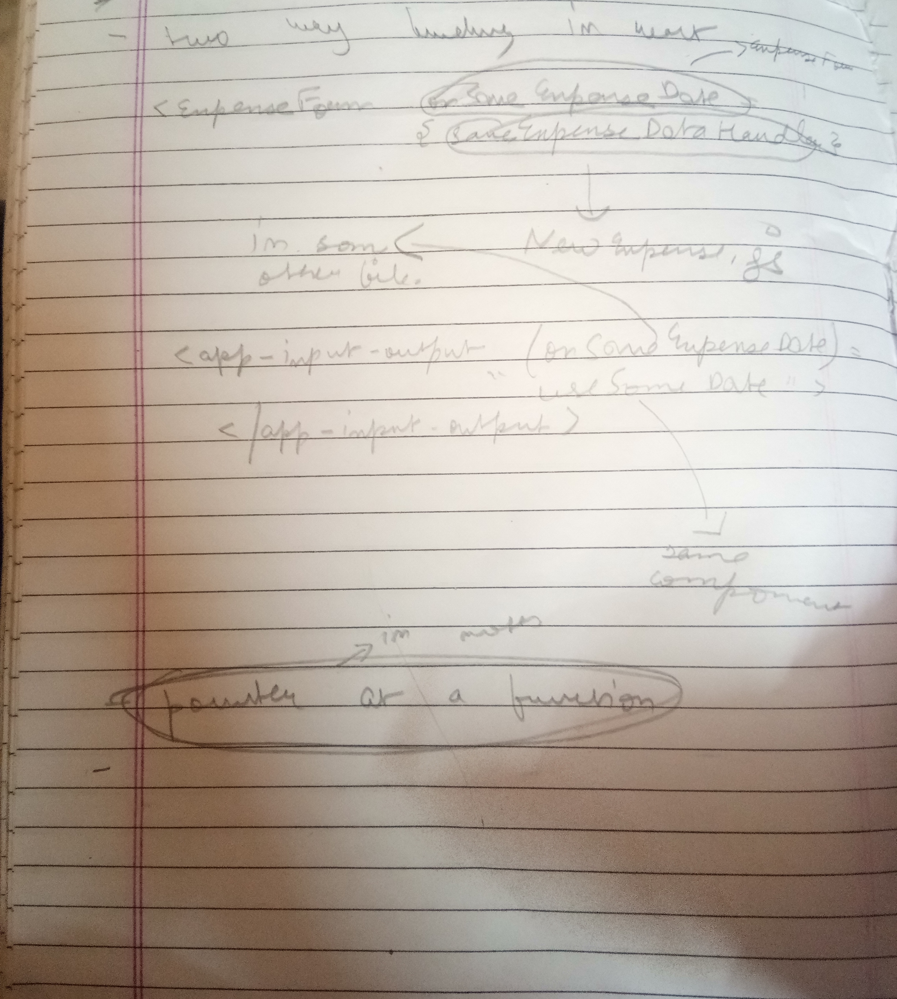

# What is JSX?

JSX stands for JavaScript XML and is a language designed to help write JavaScript code in React.

# What is React?

React is a JavaScript library(not a framework like Angular) to develope Single Page Applications.

# What is the difference between React & Angular?

React is a JavaScript Library to develop Single Page Applications(SPA) while Angular is a JavaScript framework to develop Single Page Applications.

React only supports one-way binding while Angular supports two-way binding(Source to data , data to source).

React uses virtual DOM(Document Object Model) while Angular uses real DOM(Document Object Model).

# Explain the concept of components in React.

Components are the building blocks of React. Components are nothing but different parts of a Application which are required to run it. There are two types of components in React:

- Functional based components
- Class based components


Functional based components are nothing but functions inside a React file:
  
```
    function App() {
    return (
        <div>
        <h2> Let's get strated! </h2>
        <ExpenseItem></ExpenseItem>
        </div>
    );
    }
```

Here App() is a function inside which we write our JSX(JavaScript XML) code.

Class based components are components where we render Components instead of functions like this:

```
class App extends React.Component {
        render() {
            return <h1>GeeksForGeeks</h1>;
        }
    }
```

    

Here a class named App is rendered instead of a function, but in both cases App is exported(or any other name).

# How do you get started in React & what version are you using to learn React?

To get started in React, you need to install a package named ```create-react-app``` from npmjs.com by using the following command:

```
npm i create-react-app
```

then you need to create a sample project to write some code:

```
npx create-react-app my-app
```

This will create a application named my-app in your folder where you run this command. Now you need to go to the application that you have created:

```
cd my-app
```

and then you need to run the follwoing code:

```
npm run start
```

Happy coding!

The version we are using is 17.0.2

```
"react": "^17.0.2",
"react-dom": "^17.0.2",
```

# State in React

## You can update state in react through two ways(actuallt there is only one way, the other one is just a modified version of the preivous one)

Here is the first one:

```
import React, { useState } from 'react';

import ExpenseDate from './ExpenseDate';
import Card from '../UI/Card';
import './ExpenseItem.css';

const ExpenseItem = (props) => {
  // function clickHandler() {}
  const [title, setTitle] = useState(props.title);
  console.log('ExpenseItem evaluated by React');
  
  const clickHandler = () => {
    setTitle('Updated!');
    console.log(title);
  };

  return (
    <Card className='expense-item'>
      <ExpenseDate date={props.date} />
      <div className='expense-item__description'>
        <h2>{title}</h2>
        <div className='expense-item__price'>${props.amount}</div>
      </div>
      <button onClick={clickHandler}>Change Title</button>
    </Card>
  );
}

export default ExpenseItem;

```

where you use useState() via clickHandler() function to update the title to a static string i.e. 'Updated!'. Here setTitle() is also a function which takes a string to update the variable(props.title).

The second way is to update the function clickHandler to take a variable name & update the property props.title with the same name i.e. something like this:

```
import React, { useState } from 'react';

import ExpenseDate from './ExpenseDate';
import Card from '../UI/Card';
import './ExpenseItem.css';

const ExpenseItem = (props) => {
  // function clickHandler() {}
  const [title, setTitle] = useState(props.title);

  function clickHandler(variable)  {
    console.log(variable);
    setTitle(variable);
  }
  console.log('ExpenseItem evaluated by React');
  

  return ( 
    <Card className='expense-item'>
      <ExpenseDate date={props.date} />
      <div className='expense-item__description'>
        <h2>{title}</h2>
        <div className='expense-item__price'>${props.amount}</div>
      </div>
      <button onClick={() =>  clickHandler('I was updated via function in click handler')}>Change Title</button>
    </Card>
  );
}

export default ExpenseItem;
```

Here the core functinoality is same but now we are taking a function at clickHandler(variable) which now takes a variable name instead of previous one which was empty and updates the title with the variable we passed.

That's why you can see thath setTitle(variable) now takes a variable instaead of a static string.

These are the two ways of updating the variable via state by using useState().

# Event handlers in React js

Listening to event change is an important aspect in any javascript project. Event handlers are the handlers which handle the evnet when users do something like click on button, onblur,onfocus,onDrag,etc.

Adding event handlers in React is similiar to adding event listeners in plain JavaScript DOM except there are some syntactical changes.

Like for example when a user submits the button:

```
<button onclick = "myFunction"> (in javascript)

<button onCLick = {myFunction}> (in react)
```

Majorly there is no difference except for using it(i.e. Syntax). Here are some majorly used events in react:

onClick 
onContextMenu 
onDoubleClick 
onDrag 
onDragEnd 
onDragEnter 
onDragExit
onDragLeave 
onDragOver 
onDragStart 
onDrop 
onMouseDown 
onMouseEnter 
onMouseLeave
onMouseMove 
onMouseOut 
onMouseOver 
onMouseUp

There are many more but these are the most common.

# Forms in React

# Calling a function from another component



